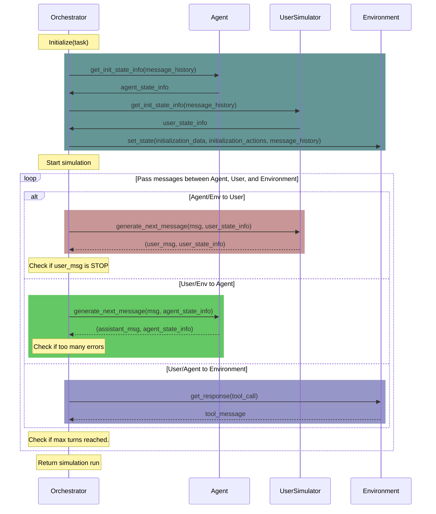

# $\tau^2$-Bench: Evaluating Conversational Agents in a Dual-Control Environment

[](https://www.python.org)
[](https://github.com/astral-sh/ruff)
[](https://github.com/psf/black)
[](https://arxiv.org/abs/2506.07982)
[](https://sierra.ai/blog/benchmarking-agents-in-collaborative-real-world-scenarios)
[](https://x.com/SierraPlatform/status/1932464265207889974)
[](https://www.linkedin.com/posts/sierra_last-year-we-introduced-%F0%9D%9C%8F-bench-a-benchmark-activity-7338229693898231809-F8L4?utm_source=share&utm_medium=member_desktop&rcm=ACoAAAdc8goBmhEsiEo1_t_XSJbAnY4_zMfAWcE)
[](https://taubench.com)

<div align="center">
<br>
<em>Figure 1: τ²-bench allows users to interact with the agent and the environment</em>
</div>

<div align="center">
<br>
<em>Figure 2: Trajectory of a conversation between an agent and a user</em>
</div>

## 🆕 What's New

### 🤖 Reinforcement Learning Support (New!)
τ²-bench now supports RL training with a Gymnasium-compatible interface:

- **🏋️ Train RL Agents**: Use the gym interface to train agents with popular RL frameworks. 
- **🎮 Play as Agent or User**: Interactive mode lets you control either the agent or the user in conversations
- **📊 Train/Test Splits**: To help support experiments around training Agents and evaluating them, all domains include standardized task splits for proper train/test evaluation.

> **⚠️ IMPORTANT FOR BACKWARD COMPATIBILITY**: If you are just evaluating an agent (not training), you **MUST** use the `base` task split to evaluate on the complete task set that matches the original τ²-bench structure. This ensures your results are comparable to previous evaluations and maintains consistency with the established benchmark. (If you don't specify a task split, it will default to `base`.)
- **🔧 Gymnasium Compatible**: Standard gym interface works with existing RL tools and libraries

[**→ See Gym Documentation**](src/tau2/gym/README.md) | [**→ Try CLI Play Mode**](#interactive-play-mode)

### 🏆 Live Leaderboard (v0.2.0)
The τ²-bench leaderboard is now live at **[taubench.com](https://taubench.com)**! 

- **📊 Interactive Rankings**: Compare model performance across all domains
- **📱 Mobile-Friendly**: View results on any device  
- **🔍 Detailed Analysis**: Explore trajectories and conversation flows
- **📥 Easy Submission**: Submit your results directly through the interface

[**→ Visit the Leaderboard**](https://taubench.com) | [**→ Submit Your Results**](#leaderboard-submission)

## Overview

$\tau^2$-bench implements a simulation framework for evaluating customer service agents across various domains.

**$\tau^2$-bench is the new iteration of the original $\tau$-bench**, featuring code fixes and an additional telecom domain.

Each domain specifies:
- a policy that the agent must follow
- a set of tools that the agent can use
- a set of tasks to evaluate the agent's performance
- Optionally: A set of tools that the user simulator can use

Domains are:
- `mock`
- `airline`
- `retail`
- `telecom`

All the information that an agent developer needs to build an agent for a domain can be accessed through the domain's API docs. See [View domain documentation](#view-domain-documentation) for more details.

## Installation

1. Clone the repository:
```bash
git clone https://github.com/sierra-research/tau2-bench
cd tau2-bench
```

2. Create a new environment (optional)

$\tau^2$-bench requires Python 3.10 or higher. You may create and activate a new environment:

```bash
python -m venv .venv
source .venv/bin/activate
```

3. Install tau2

```bash
pip install -e .
```

This will enable you to run the `tau2` command.

**Note:** If you use `pip install .` (without `-e`), you'll need to set the `TAU2_DATA_DIR` environment variable to point to your data directory:

```bash
export TAU2_DATA_DIR=/path/to/your/tau2-bench/data
```

**Check your data directory setup:**

After installation, you can verify that your data directory is correctly configured by running:

```bash
tau2 check-data
```

This command will check if the data directory exists and print instructions if it is missing.

To remove all the generated files and the virtual environment, run:
```bash
make clean
```

## Quick Start

### Setup LLM API keys

We use [LiteLLM](https://github.com/BerriAI/litellm) to manage LLM APIs, so you can use any LLM provider supported by LiteLLM.

To provide your API keys, copy `.env.example` as `.env` and edit it to include your API keys.

### Run agent evaluation

To run a test evaluation on only 5 tasks with 1 trial per task, run:

```bash
tau2 run \ 
--domain airline \
--agent-llm gpt-4.1 \
--user-llm gpt-4.1 \
--num-trials 1 \
--num-tasks 5
```

Results will be saved in `data/tau2/simulations/`.

> **💡 Tip**: For full agent evaluation that matches the original τ²-bench methodology, remove `--num-tasks` and use `--task-split base` to evaluate on the complete task set.

## Command Line Interface

The `tau2` command provides a unified interface for all functionality:

### Running Benchmark 
```bash
tau2 run \
  --domain <domain> \
  --agent-llm <llm_name> \
  --user-llm <llm_name> \
  --num-trials <trial_count> \
  --task-ids <task_ids> \
  --max-concurrency <concurrent_sims> \
  ...
```

### Interactive Play Mode
```bash
tau2 play
```
Experience τ²-bench from either perspective! The play mode allows you to:
- **Play as Agent**: Manually control the agent's responses and tool calls
- **Play as User**: Control the user while an LLM agent handles requests (available in domains with user tools like telecom)
- **Understand tasks** by walking through scenarios step-by-step
- **Test strategies** before implementing them in code
- **Choose task splits** to practice on training data or test on held-out tasks

This is perfect for:
- Getting familiar with domain policies and tools from both perspectives
- Debugging task scenarios and conversation flows
- Developing intuition for agent strategies
- Testing user behavior and agent responses
- Training yourself before training your model!

See the [Gym Documentation](src/tau2/gym/README.md) for more details on using the gymnasium interface programmatically, including the `AgentGymEnv` (play as agent) and `UserGymEnv` (play as user).

### Viewing Results
```bash
tau2 view
```
This tool allows you to:
- Browse simulation files (in `data/tau2/simulations/`)
- View agent performance metrics
- View a particular simulation
- View task details

### View domain documentation
```bash
tau2 domain <domain>
```
Visit http://127.0.0.1:8004/redoc to see the domain policy and API documentation.


### Check data configuration
```bash
tau2 check-data
```
This command checks if your data directory is properly configured and all required files are present.

## Leaderboard Submission

To submit your agent results to the τ²-bench leaderboard, you need to prepare a valid submission package that meets specific requirements.

### Requirements for Valid Submissions

Your trajectory runs must follow these constraints:

1. **Complete domain coverage**: Include results for all three domains:
   - `retail`
   - `airline` 
   - `telecom`

2. **Consistent model configuration**: All trajectory files must use:
   - The same agent LLM with identical arguments across all domains
   - The same user simulator LLM with identical arguments across all domains

3. **One result per domain**: Each domain should appear exactly once in your submission

4. **All tasks completed**: Run evaluation on all tasks within each domain (don't use `--task-ids` or `--num-tasks` filters)

> **📝 Note**: For consistency with the original τ²-bench evaluation methodology, use the `base` task split when evaluating your agent to ensure you're testing on the complete, standard task set.

### Preparing Your Submission

#### Step 1: Run Evaluations
First, run your agent evaluation on all domains with consistent settings:

```bash
# Example: Run complete evaluation for all domains
tau2 run --domain retail --agent-llm gpt-4.1 --user-llm gpt-4.1 --num-trials 4 --save-to my_model_retail
tau2 run --domain airline --agent-llm gpt-4.1 --user-llm gpt-4.1 --num-trials 4 --save-to my_model_airline  
tau2 run --domain telecom --agent-llm gpt-4.1 --user-llm gpt-4.1 --num-trials 4 --save-to my_model_telecom
```

**Important**: Use identical `--agent-llm`, `--user-llm`, and their arguments across all runs.

#### Step 2: Prepare Submission Package
Use the submission preparation tool to create your leaderboard submission:

```bash
tau2 submit prepare data/tau2/simulations/my_model_*.json --output ./my_submission
```

This command will:
- Verify all trajectory files are valid
- Check that submission requirements are met
- Compute performance metrics (Pass^k rates)
- Prompt for required metadata (model name, organization, contact email)
- Create a structured submission directory with:
  - `submission.json`: Metadata and metrics
  - `trajectories/`: Your trajectory files

#### Step 3: Validate Your Submission
Before submitting, validate your submission package:

```bash
tau2 submit validate ./my_submission
```

This will verify:
- All required files are present
- Trajectory files are valid
- Domain coverage is complete
- Model configurations are consistent

### Additional Options

#### Skip Verification (if needed)
```bash
tau2 submit prepare data/tau2/simulations/my_model_*.json --output ./my_submission --no-verify
```

#### Verify Individual Trajectory Files
```bash
tau2 submit verify-trajs data/tau2/simulations/my_model_*.json
```

### Submitting to the Leaderboard

Once your submission package is prepared and validated:

1. Review the generated `submission.json` file
2. Follow the submission guidelines in [web/leaderboard/public/submissions/README.md](web/leaderboard/public/submissions/README.md) to create a Pull Request
3. Keep your `trajectories/` directory for reference

The leaderboard will display your model's Pass^k success rates (k=1,2,3,4) across all domains.

## Experiments

### Experimental Code Directory

The `@experiments/` directory contains experimental features and research code that extends beyond the core tau2 benchmark. This directory is designed for community contributions of innovative approaches, prototypes, and new features that are not part of the core evaluation framework.

- **Purpose**: Research code and experimental features
- **Location**: `src/experiments/`
- **Usage**: Each experimental component has its own README with documentation
- **Status**: Experimental code is provided as-is and may not be fully tested or supported

For more details, see the [experiments README](src/experiments/README.md).

### Running Ablation Studies (No User, or Agent with Oracle Plan)
`telecom` domain enables running ablation studies.

1. Running an LLM in `no-user` mode. In this mode, the LLM is given all the tools and the information upfront.
Just choose `llm_agent_solo` as the agent and `dummy_user` as the user.

```bash
tau2 run \
  --domain telecom \
  --agent llm_agent_solo \
  --agent-llm gpt-4.1 \
  --user dummy_user \
  ...
```

2. Running an LLM in `oracle-plan` mode. In this mode, the LLM is given an oracle plan ahead of time alleviating the need for action planning.
Just choose `llm_agent_gt` as the agent.

```bash
tau2 run \
  --domain telecom \
  --agent llm_agent_gt \
  --agent-llm gpt-4.1 \
  --user-llm gpt-4.1 \
  ...
```

### Running Telecom Domain with Workflow Policy
To test the impact of policy format, we provide an additional "workflow" policy for the telecom domain.
To run using this policy, use the `telecom-workflow` domain.

```bash
tau2 run \
  --domain telecom-workflow \
  --agent-llm gpt-4.1 \
  --user-llm gpt-4.1 \
  ...
```

## Domains

For all the details see the domains [README](src/tau2/domains/README.md).

### Basics

- Code is located in `src/tau2/domains/`
- Data is located in `data/tau2/domains/`
- Each domain has its own configuration and task definitions

#### View domain-specific policy and API docs:
Run the following command to see the domain policy and API documentation.
```bash
tau2 env <domain>
```

Then visit http://127.0.0.1:8004/redoc

### Environment CLI (beta)

An interactive command-line interface for directly querying and testing domain environments. Features:
- Interactive query interface with domain-specific tools
- Support for multiple domains (airline, mock, etc.)
- Session management with history

To use:
```bash
make env-cli
```

Available commands:
- `:q` - quit the program
- `:d` - change domain
- `:n` - start new session (clears history)

Example usage:
```bash
$ make env-cli

Welcome to the Environment CLI!
Connected to airline domain.

Query (:n new session, :d change domain, :q quit)> What flights are available from SF to LA tomorrow?
Assistant: Let me check the flight availability for you...
[Flight details will appear here]
```

The Environment CLI is useful for:
- Testing domain tools and queries
- Debugging environment responses
- Exploring available domain functionality
- Quick domain interaction without starting the full server stack


## Run tests
To run the test suite use the command

```sh
make test
```

## Config

To configure the framework, see the [config](src/tau2/config.py) file.

### LLM Calls caching
LLM call caching is disabled by default.

To enable LLM calls caching:
    - Make sure `redis` is running.
    - Update the redis config in `config.py` if necessary.
    - Set `LLM_CACHE_ENABLED` to `True` in `config.py`


## Evaluate Your Own Agent
For local or remote agent evaluation, see our [agent developer guide](src/tau2/agent/README.md).

## Contributing

We welcome contributions to τ²-bench! Whether you're fixing bugs, adding new features, creating new domains, or contributing experimental research code, please see our [Contributing Guide](CONTRIBUTING.md) for detailed guidelines on:

- **Opening issues** before starting work
- **Branch naming conventions** and development workflow  
- **Code quality standards** and testing requirements
- **Pull request guidelines** for clean, reviewable contributions
- **Domain and experimental contributions** specific guidelines

For experimental features and research code, check out the [`@experiments/`](src/experiments/) directory.

## Orchestration Sequence Diagram



## Citation

```bibtex
@misc{barres2025tau2,
      title={$\tau^2$-Bench: Evaluating Conversational Agents in a Dual-Control Environment}, 
      author={Victor Barres and Honghua Dong and Soham Ray and Xujie Si and Karthik Narasimhan},
      year={2025},
      eprint={2506.07982},
      archivePrefix={arXiv},
      primaryClass={cs.AI},
      url={https://arxiv.org/abs/2506.07982}, 
}
```
