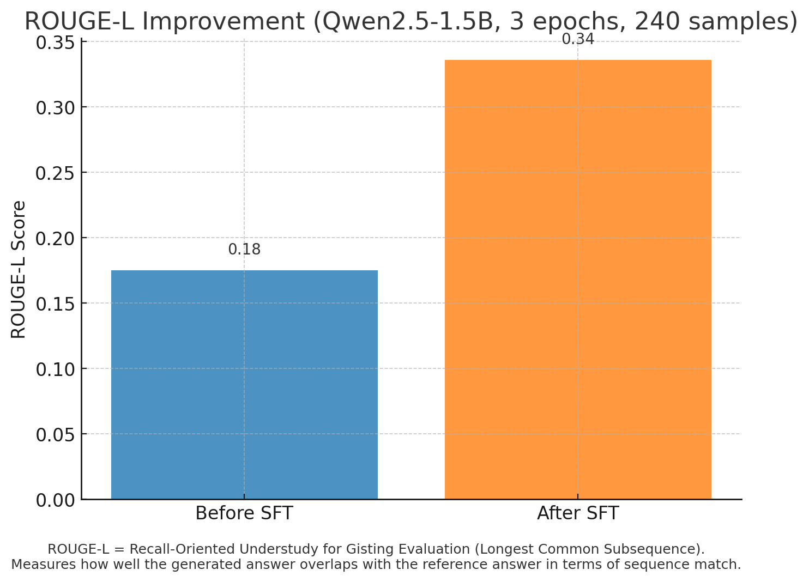
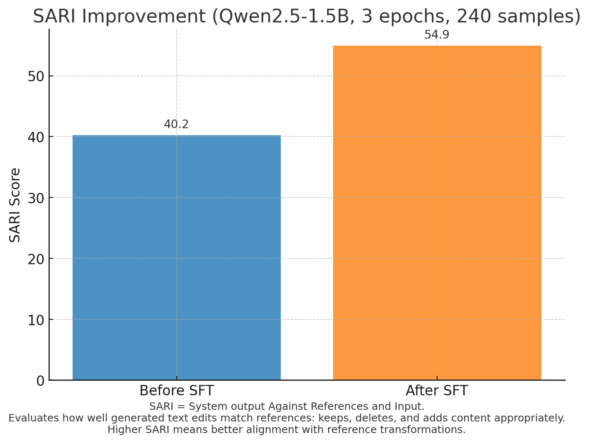

# SFT-Play (QLoRA-ready, 8-GB Friendly) - QLoRA-ready SFT starter kit

[](https://opensource.org/licenses/MIT)
[](https://www.python.org/downloads/)
[](https://pytorch.org/)
[](https://huggingface.co/transformers/)
[](https://github.com/psf/black)

**Plug-and-play Supervised Fine-Tuning** on small GPUs.
Single config, QLoRA/LoRA/Full switches, bitsandbytes/Unsloth backends, Jinja chat templating, TensorBoard live UI, and lean checkpoints (save adapters, not full models).

---

## 🎯 Who Should Use SFT-Play?

- **AI hobbyists** — fine-tune models on your own dataset without cloud GPUs
- **Researchers** — run small-scale experiments before scaling to larger infrastructure
- **Educators** — teach LLM fine-tuning with a minimal, reproducible setup
- **Open-source contributors** — build datasets + share fine-tuned models efficiently
- **Developers** — prototype AI features with custom models on local hardware

---

## ✨ Features

* **Runs on any single GPU (8 GB+)** — VRAM probe auto-tunes batch/grad-accum.
* **Two-config UX** — `config_base.yaml` (defaults) + backend-specific configs (`run_bnb.yaml`, `run_unsloth.yaml`).
* **Tuning modes** — `qlora | lora | full` (config switch).
* **Task modes** — `sft` (supervised fine-tuning) | `cpt` (continued pretraining) | `cpt_mixed` (CPT + instruction data).
* **DAPT Support** — Domain-Adaptive Pretraining with DOCX processing and mixed training.
* **Backends** — `bitsandbytes` (default) or `unsloth` (optional; auto-fallback to bnb).
* **Data pipeline** — raw → structured chat (`system,user,assistant`) → Jinja render on-the-fly.
* **UI** — **TensorBoard** only (loss/metrics/LR; optional GPU stats).
* **Model Caching** - Automatically download models from Hugging Face Hub and cache them locally.
* **Tiny checkpoints** — LoRA adapters only (~50-200 MB vs. full model's multiple GB).
* **Complete automation** — Makefile + workflows for zero-config setup.

---

## 🗂️ Repo Layout

```
PLAY/
├─ configs/                    # Training configurations
│  ├─ config_base.yaml
│  ├─ config_run.yaml
│  ├─ run_bnb.yaml
│  ├─ run_dapt.yaml
│  └─ run_unsloth.yaml
├─ chat_templates/             # Chat formatting templates
│  └─ default.jinja
├─ data/                       # SFT training data
│  ├─ processed/              # Processed training data
│  │  └─ train.jsonl          # 778 DPIP samples ready for training
│  ├─ processed_with_style/
│  ├─ raw/
│  ├─ rendered/
│  ├─ generated/
│  └─ sft/
│     └─ train.jsonl          # Exported SFT format
├─ data-generation/            # QnA data generation pipeline
│  ├─ configs/                # Generation configs
│  ├─ prompts/                # Python prompt modules
│  ├─ qna_core/               # Core modules (loaders, chunking, validation)
│  ├─ scripts/                # Generation scripts
│  ├─ data/
│  │  ├─ generated/
│  │  ├─ processed/
│  │  └─ raw_docs/            # Put PDF/DOCX here
│  └─ generated-data/
│     └─ qna_high_confidence_validated.jsonl  # 1001 samples
├─ scripts/                    # SFT training scripts
│  ├─ train.py                # Main training script
│  ├─ eval.py
│  ├─ infer.py
│  └─ utils/
├─ adapters/                   # LoRA adapters will be saved here
├─ outputs/                    # Training outputs and logs
├─ results/                    # Evaluation results
├─ tests/                      # Unit tests
├─ workflows/                  # Batch processing scripts
├─ Makefile                    # Main pipeline commands
└─ requirements.txt            # Python dependencies
```

---

## ⚙️ Configs

### `configs/config_base.yaml` (defaults)

* Training: epochs, warmup, weight\_decay, fp16, gradient\_checkpointing
* Checkpoint/eval: `save_strategy`, `save_steps`, `eval_strategy`, `save_total_limit`, `metric_for_best_model`, `load_best_model_at_end`
* Data: `format: chat`, `template_path`, **split ratios** (train/val/test)
* Logging: `backend: tensorboard`, `log_interval`

### Backend-Specific Configs (Recommended)

**For BitsAndBytes (Stable, Broad Compatibility):**
```yaml
# configs/run_bnb.yaml
include: configs/config_base.yaml

tuning:
  backend: bnb             # BitsAndBytes backend
  mode: qlora

train:
  bf16: false              # BitsAndBytes works best with fp16
  fp16: true
  output_dir: outputs/run-bnb
```

**For Unsloth (Faster, Requires Compatible CUDA):**
```yaml
# configs/run_unsloth.yaml
include: configs/config_base.yaml

tuning:
  backend: unsloth         # Unsloth backend
  mode: qlora

train:
  bf16: true               # Unsloth works better with bfloat16
  fp16: false
  output_dir: outputs/run-unsloth
```

### Data Format Support

The training script supports **both processed and rendered data formats**:

**Processed Format (Default):**
```json
{"system": "You are a helpful assistant.", "user": "What is 2+2?", "assistant": "2+2 equals 4."}
```

**Rendered Format (Optional):**
```json
{"input": "<|im_start|>system\nYou are a helpful assistant.<|im_end|>\n<|im_start|>user\nWhat is 2+2?<|im_end|>\n<|im_start|>assistant", "target": "2+2 equals 4."}
```

**To switch to rendered data:**
1. Generate rendered data: `make render`
2. Create config pointing to rendered paths:
```yaml
data:
  train_path: data/rendered/train.jsonl
  val_path:   data/rendered/val.jsonl
  test_path:  data/rendered/test.jsonl
```

**Fallback behavior when no chat template:**
If `chat_templates/default.jinja` is missing, the system automatically creates simple format:
```
System: You are a helpful assistant.
User: What is 2+2?
Assistant:2+2 equals 4.
```

### Backend Safety Features

**Automatic Backend Stamping:**
- Each training run creates `outputs/<run>/backend.json` with backend info
- Prevents accidental resume across different backends
- Validates configuration consistency on resume

**XFormers Safety:**
- Unsloth automatically disables XFormers to prevent compatibility issues
- BitsAndBytes uses standard PyTorch attention mechanisms
- Automatic fallback from Unsloth to BitsAndBytes if import fails

**Precision Auto-Detection:**
- Auto-enables bf16 on Ada GPUs (RTX 40xx series) when neither precision is set
- Auto-enables fp16 on other GPUs as fallback
- Prevents both bf16 and fp16 being enabled simultaneously

> **Recommended Usage:** Use `configs/run_bnb.yaml` for stability or `configs/run_unsloth.yaml` for speed. The backend-specific configs ensure optimal settings and prevent configuration conflicts.

---

## 🤗 Hugging Face Token

To download models from the Hugging Face Hub, you need to provide an access token. You can do this in one of three ways:

1.  **CLI Login (Recommended):**
    ```bash
    huggingface-cli login
    ```
    This will store your token securely on your machine.

2.  **Environment Variable:**
    ```bash
    export HUGGINGFACE_HUB_TOKEN=hf_...
    ```
    You can add this to your shell profile (e.g., `.bashrc`, `.zshrc`) or a `.env` file.

3.  **Offline Mode:**
    After downloading a model once, you can work offline:
    ```bash
    export HF_HUB_OFFLINE=1
    ```

## 📈 TensorBoard

We log to a fixed path: `outputs/tb`.

**Automatic TensorBoard (Recommended):**
```bash
make train-bnb-tb           # BitsAndBytes training with TensorBoard auto-start
make train-unsloth-tb       # Unsloth training with TensorBoard auto-start
```

**Manual TensorBoard:**
```bash
make tensorboard            # uses port 6006
make tensorboard TB_PORT=6006
```

Stop it:
```bash
make tb-stop
```

**How it works:**
- The `-tb` training targets automatically start TensorBoard in the background before training
- TensorBoard runs on port 6006 by default (configurable with TB_PORT)
- After training completes, TensorBoard continues running for you to review results
- Use `make tb-stop` to stop TensorBoard when you're done

If TB shows "No dashboards…" check you're pointing at the absolute path:
```bash
tensorboard --logdir "$(pwd)/outputs/tb" --port 6006
```

### TensorBoard Screenshots

**Training Progress Monitoring:**


**Loss and Learning Rate Tracking:**


**Evaluation Metrics:**


## 🚀 Quickstart

### Option 1: Automated Setup (Recommended)

**Complete setup in one command:**

```bash
./workflows/quick_start.sh
```

This interactive script will:
- Install dependencies (auto-detects uv or pip)
- Create all necessary directories
- Generate sample data if none exists
- Process data through the complete pipeline
- Guide you to training

**Setup and Training Screenshots:**


**Or use individual Makefile commands:**

```bash
make help                    # See all available commands
make install                 # Install dependencies
make setup-dirs             # Create directories
make full-pipeline          # Complete data processing
make check                  # Validate setup before training
make train-with-tb          # Train with TensorBoard monitoring
```

You can also pre-download models using the Makefile:
```bash
make download-model MODEL=Qwen/Qwen2.5-3B-Instruct
```

### Option 2: Manual Step-by-Step

#### 0) Install

```bash
pip install -r requirements.txt
# or
# uv venv && uv pip install -e .
```

(Optional) Configure Accelerate:

```bash
accelerate config  # or use env/accelerate_config.yaml
```

#### 1) Add raw data

Create `data/raw/raw.jsonl` or `raw.json`. Example (JSONL):

```json
{"system":"You are a helpful assistant.","user":"What is machine learning?","assistant":"Machine learning is..."}
```

(Your `process_data.py` also supports simple dicts like `{"question":"...","answer":"..."}`.)

#### 2) Process raw → structured chat

```bash
python scripts/process_data.py --config configs/run_bnb.yaml --raw_path data/raw/raw.jsonl
# writes data/processed/{train,val,test}.jsonl
```

#### 3) (Optional) Inject style/system rule

```bash
python scripts/style_prompt.py --config configs/run_bnb.yaml \
  --style "Answer in ≤2 concise sentences. No markdown." \
  --in data/processed/train.jsonl \
  --out data/processed_with_style/train.jsonl
# repeat for val/test if desired and update config data paths
```

#### 4) Validate setup

```bash
make check                   # Comprehensive sanity check
```

#### 5) Train (TensorBoard logs)

```bash
python scripts/train.py --config configs/run_bnb.yaml
tensorboard --logdir outputs/
```

* See `train/loss`, `eval/loss`, `train/lr`, and `eval/rougeL` live.
* Checkpoints saved every `save_steps` (adapters + trainer state only).

#### 6) Evaluate

```bash
python scripts/eval.py --config configs/run_bnb.yaml --split val
# writes outputs/metrics.json and outputs/samples.jsonl
```

#### 7) Inference

Interactive:

```bash
python scripts/infer.py --config configs/run_bnb.yaml
```

Batch:

```bash
echo "Explain QLoRA in two lines." > demo_inputs.txt
python scripts/infer.py --config configs/run_bnb.yaml --mode batch --input_file demo_inputs.txt --output_file outputs/preds.txt
```

##### Inference Quality Improvements

The inference script includes several optimizations to ensure high-quality, single-turn responses:

**1. Proper Stopping Conditions**
- Forces stop at EOS tokens using `eos_token_id=tokenizer.eos_token_id`
- Adds custom stop tokens for chat template boundaries (`<|user|>`, `</|assistant|>`)
- Prevents multi-turn generation where the model continues beyond the assistant's response

**2. Template Boundary Parsing**
- Extracts only the assistant's response from the full generation
- Strips everything after the first `<|assistant|>` → `<|user|>` boundary
- Handles both `</|assistant|>` end tags and natural conversation boundaries

**3. Template Consistency**
- Loads the same Jinja chat template used during training
- Ensures inference format exactly matches training format
- Prevents template mismatches that can cause poor generation quality

**Example of clean output extraction:**
```python
# Raw generation might include:
# "<|system|>You are helpful</|system|><|user|>Hello</|user|><|assistant|>Hi there!<|user|>..."

# Cleaned output extracts only:
# "Hi there!"
```

These improvements ensure that:
- Models stop generating at appropriate conversation boundaries
- Output is clean and contains only the intended assistant response
- Template consistency is maintained between training and inference
- Multi-turn conversations don't bleed into single responses

**Inference in Action:**


#### 8) (Optional) Merge adapters → FP16 model

```bash
python scripts/merge_lora.py --config configs/run_bnb.yaml \
  --adapters adapters/last \
  --out outputs/merged_fp16 \
  --dtype fp16
```

---

## 🧬 DAPT (Domain-Adaptive Pretraining)

SFT-Play now supports **Domain-Adaptive Pretraining (DAPT)** for adapting models to specific domains while preserving their instruction-following capabilities.

### What is DAPT?

DAPT combines **Continued Pretraining (CPT)** on domain-specific text with **instruction data** to:
- Inject domain knowledge into the model
- Maintain chat/instruction-following abilities
- Achieve better performance on domain-specific tasks

### DAPT Features

* **DOCX Processing** — Automatic conversion of Word documents to training data
* **Mixed Training** — 90% domain text + 10% instruction data (configurable)
* **Memory Efficient** — Uses QLoRA for 8GB+ GPU compatibility
* **Automated Pipeline** — Simple Makefile commands for end-to-end workflow

### DAPT Configuration

**Create a DAPT config (`configs/run_dapt.yaml`):**
```yaml
include: configs/config_base.yaml

task_mode: cpt_mixed                  # sft | cpt | cpt_mixed

# Packing parameters for CPT
block_size: 2048
pack_factor: 4

# Mixed datasets with weights
datasets:
  - name: dpip_cpt
    path: data/processed/dpip_cpt.jsonl
    type: cpt
    weight: 0.9                       # 90% domain text
  - name: anchor_instr
    path: data/processed/anchor_instr.jsonl
    type: chat
    weight: 0.1                       # 10% instruction data

model:
  name: google/gemma-3-27b-it
  max_seq_len: 2048

tuning:
  mode: qlora
  backend: bnb

train:
  epochs: 1
  learning_rate: 1.0e-4
  output_dir: outputs/run-dapt
```

### DAPT Workflow

**Quick Start:**
```bash
# 1. Place DOCX files in data/raw/
# 2. Process documents to CPT format
make dapt-docx

# 3. Start DAPT training
make dapt-train
```

**Detailed Steps:**

1. **Prepare Domain Documents**
   ```bash
   # Place .docx files in data/raw/
   cp your_domain_docs/*.docx data/raw/
   ```

2. **Process Documents**
   ```bash
   make dapt-docx
   # Creates data/processed/dpip_cpt.jsonl with chunked text
   ```

3. **Configure Training**
   ```bash
   # Edit configs/run_dapt.yaml if needed
   # Adjust dataset weights, model size, etc.
   ```

4. **Start Training**
   ```bash
   make dapt-train
   # Trains with mixed CPT + instruction data
   ```

### DAPT Data Formats

**CPT Data Format (from DOCX processing):**
```json
{"text": "<dpip_doc>Document content chunked into paragraphs...</dpip_doc>"}
```

**Instruction Data Format (anchor data):**
```json
{"messages": [{"role": "user", "content": "What is machine learning?"}, {"role": "assistant", "content": "Machine learning is..."}]}
```

### DAPT Scripts

**Document Processing (`scripts/ingest_docx.py`):**
- Converts DOCX files to plain text
- Chunks text by paragraphs
- Adds special `<dpip_doc>` tags
- Outputs CPT-format JSONL

**Dataset Handling (`scripts/datasets_cpt.py`):**
- Loads and tokenizes CPT data
- Implements sequence packing for efficiency
- Handles mixed dataset sampling

**Data Collation (`scripts/collators_cpt.py`):**
- Generic collator for both CPT and chat data
- Handles variable sequence lengths
- Optimized for memory efficiency

### DAPT Configuration Options

**Task Modes:**
- `sft`: Standard supervised fine-tuning (default)
- `cpt`: Pure continued pretraining on domain text
- `cpt_mixed`: Mixed training (CPT + instruction data)

**Key Parameters:**
```yaml
task_mode: cpt_mixed          # Training mode
block_size: 2048              # Token sequence length
pack_factor: 4                # Packing efficiency multiplier

datasets:
  - name: domain_data
    type: cpt                 # CPT data type
    weight: 0.9               # 90% of training
  - name: instruction_data
    type: chat               # Chat data type
    weight: 0.1               # 10% of training
```

### DAPT Testing

**Validate DAPT Integration:**
```bash
python test_dapt_integration.py
```

This test validates:
- ✅ Configuration loading
- ✅ Anchor instruction data
- ✅ Script imports
- ✅ Training compatibility
- ✅ Makefile targets

### DAPT Use Cases

**Academic Research:**
- Adapt models to scientific literature
- Domain-specific Q&A systems
- Technical documentation processing

**Business Applications:**
- Legal document analysis
- Medical text understanding
- Industry-specific chatbots

**Content Creation:**
- Style-specific writing assistants
- Domain-aware content generation
- Specialized knowledge bases

### DAPT Best Practices

1. **Data Quality**: Use high-quality, domain-relevant documents
2. **Mixing Ratios**: Start with 90% CPT + 10% instruction data
3. **Sequence Length**: Use longer sequences (2048+) for better context
4. **Evaluation**: Test both domain knowledge and instruction-following
5. **Iteration**: Adjust mixing ratios based on downstream performance

---

## 🛠️ Automation Commands

### Complete Makefile Reference

```bash
# Setup
make install                 # Install dependencies (auto-detects uv/pip)
make setup-dirs             # Create all necessary directories

# Data Pipeline
make process                # Process raw data to structured chat
make style                  # Apply style prompts to all splits
make render                 # Render chat templates
make full-pipeline          # Complete data processing pipeline

# Training & Evaluation
make train                  # Start training with current config
make train-bnb              # Start training with BitsAndBytes backend
make train-unsloth          # Start training with Unsloth backend
make train-with-tb          # Train with TensorBoard monitoring
make train-bnb-tb           # BitsAndBytes training with TensorBoard
make train-unsloth-tb       # Unsloth training with TensorBoard
make eval                   # Evaluate on validation set
make eval-test              # Evaluate on test set
make eval-quick             # Quick evaluation (200 samples)
make eval-full              # Full evaluation (no limit)

# Inference
make infer                  # Interactive inference (chat mode)
make infer-batch            # Batch inference from file
make infer-interactive      # Interactive inference (explicit)

# Model Management
make download-model         # Download a model from Hugging Face Hub
make merge                  # Merge LoRA adapters to FP16 model
make merge-bf16             # Merge LoRA adapters to BF16 model
make merge-test             # Test merged model loading

# Monitoring
make tensorboard            # Start TensorBoard on outputs/tb
make tb-stop                # Kill any running TensorBoard
make tb-clean               # Remove TB event files
make tb-open                # Print exact path & suggest URL

# DAPT (Domain-Adaptive Pretraining)
make dapt-docx              # Process DOCX files for DAPT
make dapt-train             # Start DAPT training

# Utilities
make check                  # Validate project setup
make clean                  # Clean generated files
make help                   # Show all commands
```

### Workflow Scripts

```bash
# Interactive setup with sample data
./workflows/quick_start.sh

# Batch processing for multiple datasets
./workflows/batch_process.sh
```

### Customization

```bash
# Custom style prompts
make style STYLE="Answer in JSON format only"

# Custom configuration
make train CONFIG=configs/my_config.yaml

# Custom workflows
make process && make style && make train
```

---

## 🧠 Design Notes

* **Memory-efficient checkpoints**: we save **only LoRA adapters** + trainer state. Result: tiny checkpoints, fast resume. Merge at the end only if you need a single FP16 folder.
* **VRAM-aware**: when `batch_size/grad_accum` are `auto`, training probes free VRAM and picks safe values (starts at `bs=1`, increases accumulation).
* **Template flexibility**: training renders Jinja on-the-fly, so you can change `chat_templates/default.jinja` without reprocessing.
  ```jinja
  {{ system }}
  User: {{ user }}
  Assistant: {{ assistant }}
  ```
* **Backends**: set `tuning.backend: unsloth` if installed; otherwise it auto-falls back to bnb with a warning.
* **Complete automation**: Makefile provides 20+ commands for every aspect of the pipeline.
* **VRAM efficiency**: Qwen2.5-3B + QLoRA + bnb → ~6.5 GB VRAM at seq_len=512
* **Modes**:

  * `qlora` → 4-bit base + LoRA (best for 8 GB on 7B/3B causal LMs)
  * `lora`  → fp16/bf16 base + LoRA (fine for 1–3B, or enough VRAM)
  * `full`  → full fine-tune (use for small seq2seq, e.g., FLAN-T5-base)

---

## 🧪 Troubleshooting

### Recent Fixes & Improvements

* **Functional Tests Fixed (v0.1.1)**
  - Fixed `test_full_pipeline_produces_valid_training_data` to handle small validation datasets gracefully
  - Fixed `test_process_fails_with_invalid_data` error message assertion to check both stdout and stderr
  - All 10 functional tests now pass consistently

* **TensorBoard Integration Fixed (v0.1.1)**
  - Fixed `make train-bnb-tb` command termination issue caused by `pkill` conflicts
  - TensorBoard now starts reliably and runs alongside training
  - Improved process management for safer TensorBoard operations
  - Fixed `TB_LOGDIR` variable to handle missing directories properly

* **Test Robustness Improvements**
  - Enhanced test suite to handle edge cases with small datasets
  - Improved error message validation across different output streams
  - Better handling of validation split edge cases in data processing

### Configuration Issues

* **Training Arguments Mismatch Error**
  ```
  ValueError: --load_best_model_at_end requires the save and eval strategy to match
  ```
  **Solution**: This was fixed in the training script. The issue occurred when `evaluation_strategy` and `save_strategy` didn't match. The script now properly handles both `evaluation_strategy` and `eval_strategy` keys from config files.

* **Backend Switching: BitsAndBytes ↔ Unsloth**

  **Use the provided backend-specific configs:**
  ```bash
  # For BitsAndBytes (stable, broad compatibility)
  make train CONFIG=configs/run_bnb.yaml
  
  # For Unsloth (faster, requires compatible CUDA)
  make train CONFIG=configs/run_unsloth.yaml
  ```

  **Or create custom config:**
  ```yaml
  # For Unsloth backend
  include: configs/config_base.yaml
  tuning:
    backend: unsloth
  train:
    bf16: true    # Unsloth works better with bfloat16
    fp16: false
  
  # For BitsAndBytes backend  
  include: configs/config_base.yaml
  tuning:
    backend: bnb
  train:
    bf16: false   # BitsAndBytes is more stable with float16
    fp16: true
  ```

  **Key differences:**
  - **Unsloth**: Faster training, requires specific CUDA versions, works best with `bf16: true`
  - **BitsAndBytes**: More stable, broader compatibility, works best with `fp16: true`
  - **Auto-fallback**: If Unsloth fails to import, the system automatically falls back to BitsAndBytes

### Memory and Performance Issues

* **CUDA OOM**

  * Lower `model.max_seq_len` (e.g., 512 → 384).
  * Keep `mode: qlora`, `backend: bnb`, `batch_size: auto`, `grad_accum: auto`.
  * Ensure TensorBoard isn't eating VRAM on the same GPU (runs on CPU, but double-check).

* **Unsloth import fails**

  * Use `backend: bnb` (default).
  * If you insist on Unsloth, match its CUDA/PTX requirements.

* **XFormers compatibility issues**
  ```
  NotImplementedError: No operator found for `memory_efficient_attention_backward`
  ```
  **Solution**: This is a known compatibility issue with Unsloth + XFormers on certain GPU/CUDA configurations. The system now automatically falls back to BitsAndBytes when Unsloth is requested:
  
  **Automatic Fallback**: When you use `configs/run_unsloth.yaml`, the system detects XFormers issues and automatically switches to BitsAndBytes with a warning message.
  
  **Recommended Approach**: Use BitsAndBytes directly for maximum stability:
  ```bash
  make train-bnb        # Direct BitsAndBytes training
  make train-bnb-tb     # BitsAndBytes with TensorBoard
  ```
  
  **Manual Configuration**: If you want to force BitsAndBytes:
  ```yaml
  tuning:
    backend: bnb
  train:
    bf16: false
    fp16: true
  ```

### Data and Training Issues

* **Weird formatting in generations**

  * Check `chat_templates/default.jinja` and your style prompt.
  * Remember causal LMs may echo the prompt; `infer.py` strips assistant tags heuristically.

* **Metrics too low**

  * Increase epochs to 3–5.
  * Tune LoRA `r` (16→32) or LR (2e-4 → 1e-4).
  * Ensure your processed data is clean and task-consistent.

* **ROUGE metrics showing 0.0**
  ```
  [train] Warning: Could not compute ROUGE metrics: argument 'ids': 'list' object cannot be interpreted as an integer
  ```
  **Note**: This is a known issue with the ROUGE evaluation library and doesn't affect training. The model is still learning (check the decreasing loss values).

### Setup Issues

* **Setup issues**

  * Run `make check` to validate your setup
  * Use `./workflows/quick_start.sh` for guided setup
  * Check `AUTOMATION_GUIDE.md` for detailed automation docs

### Configuration Validation

* **Before training, always validate your config:**
  ```bash
  make check                    # Comprehensive validation
  python scripts/train.py --config configs/run_bnb.yaml --help  # Check arguments
  ```

* **Common config mistakes:**
  - Mismatched `evaluation_strategy` and `save_strategy` (now auto-fixed)
  - Wrong precision settings for your backend (`bf16` vs `fp16`)
  - Missing data files or incorrect paths
  - Incompatible model settings with available VRAM

---

## ✅ Definition of Done (v0.1)

* End-to-end run on **Qwen2.5-3B (QLoRA+bnb)** on an **8 GB** GPU without OOM.
* Live TensorBoard charts.
* `outputs/metrics.json` with ROUGE-L (and others).
* `infer.py` produces sensible answers.
* (Optional) `outputs/merged_fp16` exists and loads with HF.
* **Complete automation** with Makefile and workflow scripts.
* **Sanity checking** with `make check` validation.

---

## 📚 Documentation

- **AUTOMATION_GUIDE.md** - Detailed automation system documentation
- **SETUP_DOCUMENTATION.md** - Complete project setup guide
- **LICENSE** - MIT License for open source use

---

## 🎯 Quick Examples

**Try fine-tuning on EduGen Small Q&A ([Kaggle link](https://www.kaggle.com/datasets/avinashmynampati/edugen-small-qa)). Takes ~10 min on an RTX 4060.**

### 🚀 Real Results: 10-Minute Fine-Tune Success

**Tried a 10-minute QLoRA fine-tune on Qwen2.5-1.5B with 240 Q&As (EduGen style):**

- **Baseline ROUGE-L**: 0.17 → **After SFT**: 0.33 (**~95% improvement!**)
- **SARI**: 40 → 55 (**+15 points**)

That's ~95% growth in ROUGE-L and +15 points in SARI in just 10 minutes! Even with tiny data, the model became step-by-step and precise.

**Proof that fine-tuning isn't just for labs — you can try it in a few minutes on consumer GPUs.**

#### 📊 Metric Improvements (Visual Proof)

**ROUGE-L Score Improvement:**


**SARI Score Improvement:**


### Usage Examples

**Complete beginner workflow:**
```bash
./workflows/quick_start.sh     # One command setup
make check                     # Validate everything
make train-bnb-tb             # Train with TensorBoard monitoring
```

**Advanced user workflow:**
```bash
make install && make setup-dirs
make process
make style STYLE="Be concise and professional"
make check
make train CONFIG=configs/my_qlora.yaml
make eval-test
make merge && make merge-test
```

**Development workflow:**
```bash
make full-pipeline            # Process all data
make eval-quick               # Fast validation
make infer                    # Test interactively
```

That's it! The automation system makes SFT-Play truly plug-and-play. Run `make help` to see all available commands, or start with `./workflows/quick_start.sh` for a guided experience.
